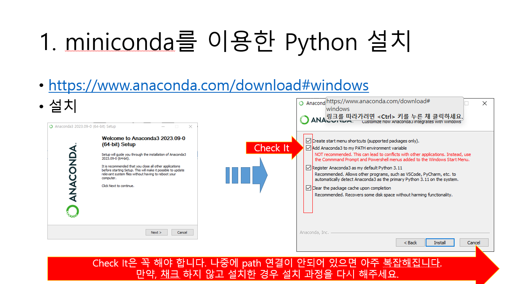
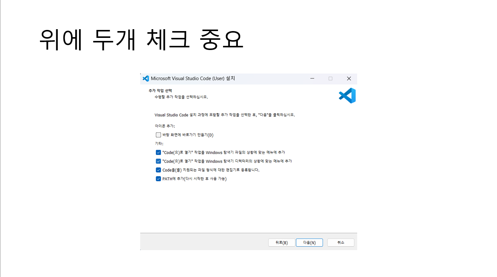
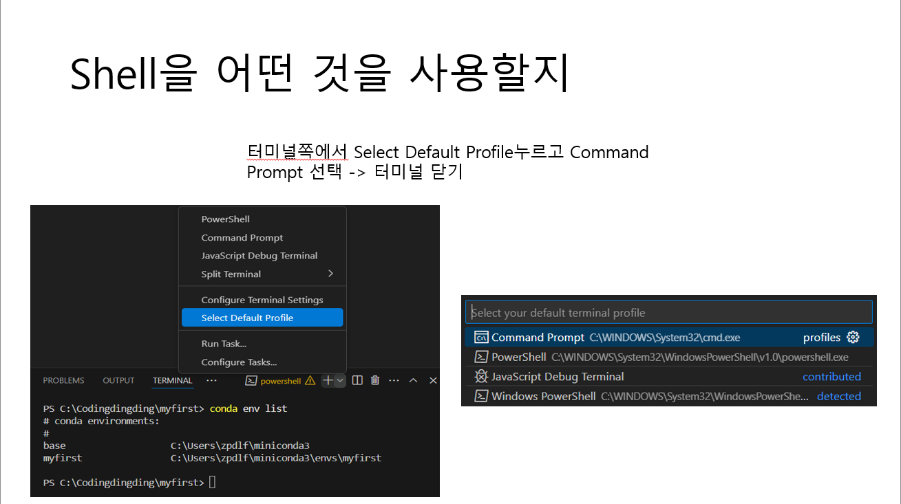
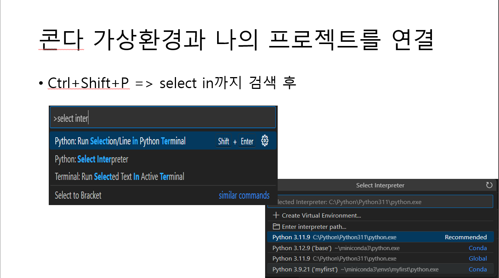
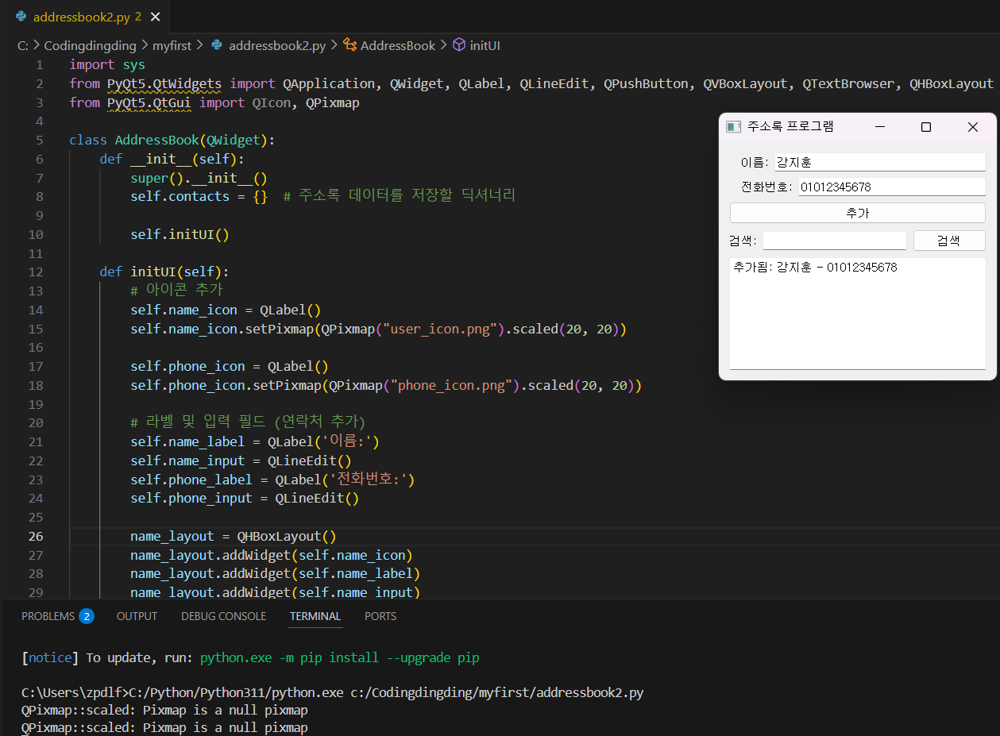

# Python_0317
### Python 개발환경 설정
1. anaconda 또는  miniconda를 이용해서 python interpreter를 설치했다.
   

   
2. vscode를 설치한다.
  
## Python 가상환경 설정
3. 가상환경 설정
   
   
4. 가상환경과 vscode를 연결
   

## 프로그램 실행
5. 완성된 주소록 설정 프로그램
   
